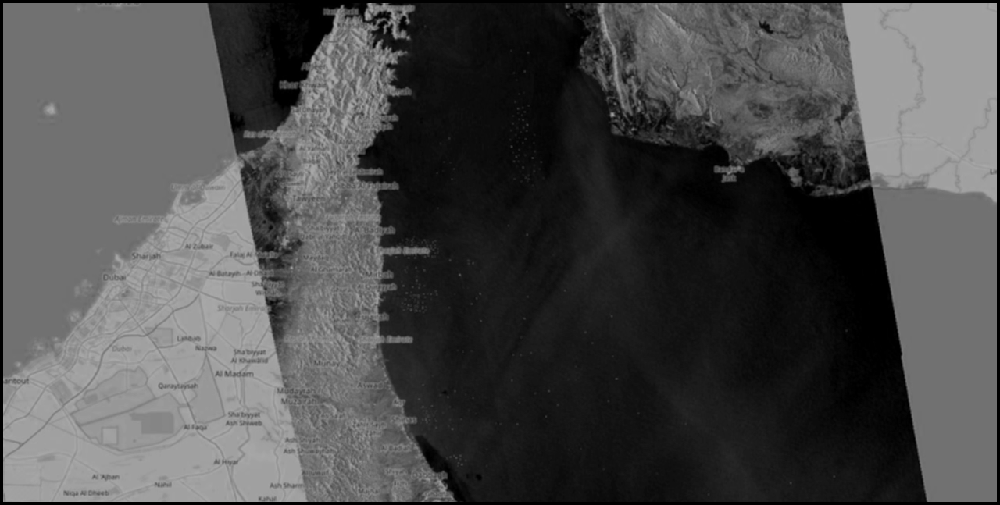
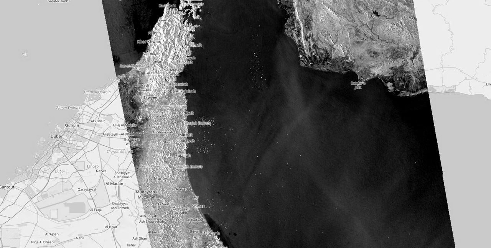
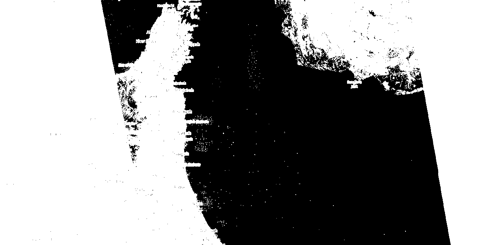
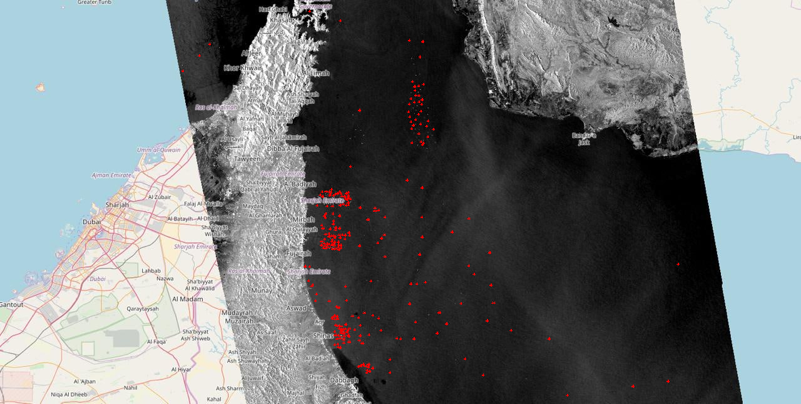

Second task: count tankers on image
=
 
Total count: 238

I left the Gaussian blur function in the file, but it is not used in the end (the image with an example of its operation before applying contrast is located in the task folder), as the tankers are "eaten up" after applying other operations

To solve the problem, the image is converted to black and white and its contrast is increased. After that, we go through all the pixels, running BFS from the current one if it is not black and has not yet been processed

The program has a lot of false positives on the shores, so in the BFS function, when a point enters these "dead zones," it causes an early exit from processing that point

If the program considers an area to be a tanker, it will mark it on the image (due to the offset boundaries, the tanker label appears as crosses)

Blur:

After casting to bw:

After contrast:

Before "dead zones" early processing:

Final result:

